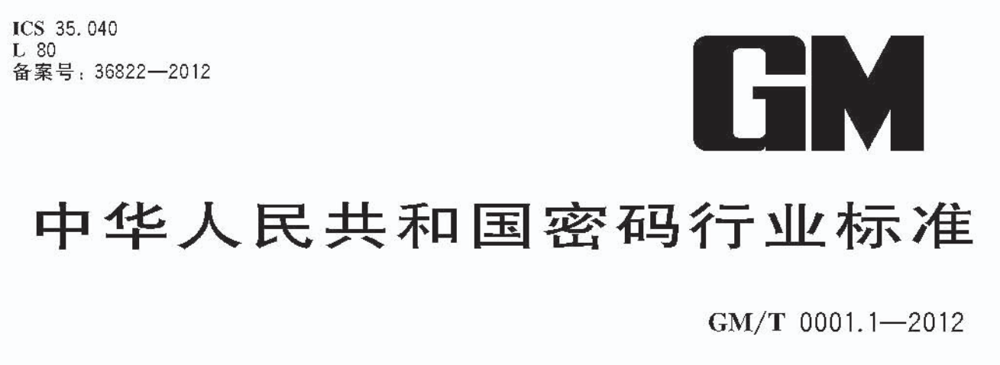

# gm-crypto-wasm



This is the wasm version of [gm-crypto](https://github.com/byte-fe/gm-crypto), it has better performance.

- [GM/T0003-2012《SM2 public key cryptographic algorithm based on elliptic curves》](http://www.oscca.gov.cn/sca/xxgk/2010-12/17/content_1002386.shtml)
- [GM/T0004-2012《SM3 cryptographic hash algorithm》](https://www.oscca.gov.cn/sca/xxgk/2010-12/17/content_1002389.shtml)
- [GM/T0002-2012《SM4 block cipher algorithm》(also aliased as SMS4)](http://www.sca.gov.cn/sca/c100061/201611/1002423/files/330480f731f64e1ea75138211ea0dc27.pdf)

## Quick Start

### Install

Using npm:

```bash
$ npm install gm-crypto-wasm
```

Using yarn:

```bash
$ yarn add gm-crypto-wasm
```

Using pnpm:

```bash
$ pnpm add gm-crypto-wasm
```

### Basic Usage

#### SM2

> Public Key Cryptographic Algorithm Based on Elliptic Curves.

```js
import { SM2 } from "gm-crypto-wasm";

const { publicKey, privateKey } = SM2.generateKeyPair();
const originalData = "SM2 椭圆曲线公钥密码算法";

const encryptedData = SM2.encrypt(originalData, publicKey, {
  inputEncoding: "utf8",
  outputEncoding: "base64",
});

const decryptedData = SM2.decrypt(encryptedData, privateKey, {
  inputEncoding: "base64",
  outputEncoding: "utf8",
});
```

#### SM3

> Cryptographic Hash Algorithm.

```js
import { SM3 } from "gm-crypto-wasm";

console.log(SM3.digest("abc"));
console.log(SM3.digest("YWJj", "base64"));
console.log(SM3.digest("616263", "hex", "base64"));
```

#### SM4

> Block Cipher Algorithm.

```js
import { SM4 } from "gm-crypto-wasm";

const key = "0123456789abcdeffedcba9876543210"; // Any string of 32 hexadecimal digits
const originalData = "SM4 国标对称加密";

/**
 * Block cipher modes:
 * - ECB: electronic codebook
 * - CBC: cipher block chaining
 */

let encryptedData, decryptedData;

// ECB
encryptedData = SM4.encrypt(originalData, key, {
  inputEncoding: "utf8",
  outputEncoding: "base64",
});
decryptedData = SM4.decrypt(encryptedData, key, {
  inputEncoding: "base64",
  outputEncoding: "utf8",
});

// CBC
const iv = "0123456789abcdeffedcba9876543210"; // Initialization vector(any string of 32 hexadecimal digits)
encryptedData = SM4.encrypt(originalData, key, {
  iv: iv,
  mode: SM4.constants.CBC,
  inputEncoding: "utf8",
  outputEncoding: "hex",
});
decryptedData = SM4.decrypt(encryptedData, key, {
  iv: iv,
  mode: SM4.constants.CBC,
  inputEncoding: "hex",
  outputEncoding: "utf8",
});
```

#### benchmark

```
// pnpm bench
 DEV  v0.34.6

 ✓ bench/inde.benchmark.ts (6) 11003ms
   ✓ sm2 (2) 9569ms
     name       hz      min      max     mean      p75      p99     p995     p999     rme  samples
   · js    20.3139  47.4460  53.8801  49.2273  49.9068  52.9934  53.8801  53.8801  ±0.52%      100
   · wasm  43.7978  21.1942  25.0285  22.8322  23.6875  25.0257  25.0285  25.0285  ±0.89%      100   fastest
   ✓ sm3 (2) 10102ms
     name          hz     min     max    mean     p75     p99    p995    p999     rme  samples
   · js    235,627.67  0.0038  0.2808  0.0042  0.0042  0.0050  0.0060  0.0139  ±0.44%   117814   fastest
   · wasm  117,832.27  0.0080  0.3047  0.0085  0.0085  0.0100  0.0117  0.0305  ±0.40%    58917
   ✓ sm4 (2) 11000ms
     name      hz     min      max    mean     p75      p99     p995     p999      rme  samples
   · js    105.40  9.0783  10.4029  9.4876  9.6397  10.2576  10.4029  10.4029   ±0.57%      100
   · wasm  113.30  6.2914  38.9562  8.8264  8.3445  28.3623  38.9562  38.9562  ±11.63%      100   fastest


 BENCH  Summary

  wasm - bench/inde.benchmark.ts > sm2
    2.16x faster than js

  js - bench/inde.benchmark.ts > sm3
    2.00x faster than wasm

  wasm - bench/inde.benchmark.ts > sm4
    1.07x faster than js
```

## API

- [SM2](#api)

  - [.generateKeyPair()](#sm2generatekeypair) ⇒ `object`
  - [.encrypt(data, key[, options]](#sm2encryptdata-key-options) ⇒ `string` | `ArrayBuffer`
  - [.decrypt(data, key[, options])](#sm2decryptdata-key-options) ⇒ `string` | `ArrayBuffer`

- [SM3](#api)

  - [.digest(data[, inputEncoding][, outputEncoding])](#sm3digestdata-inputencoding-outputencoding) ⇒ `string` | `ArrayBuffer`

- [SM4](#api)
  - [.encrypt(data, key[, options])](#sm4encryptdata-key-options) ⇒ `string` | `ArrayBuffer`
  - [.decrypt(data, key[, options])](#sm4decryptdata-key-options) ⇒ `string` | `ArrayBuffer`

### SM2.generateKeyPair()

Generates a new asymmetric key pair.

### SM2.encrypt(data, key[, options])

Encrypt data.

| Param                  | Type                              | Default  | Description                                                                                                                                                                                      |
| ---------------------- | --------------------------------- | -------- | ------------------------------------------------------------------------------------------------------------------------------------------------------------------------------------------------ |
| data                   | `string`\|`ArrayBuffer`\|`Buffer` |          | Plain message                                                                                                                                                                                    |
| key                    | `string`                          |          | Public key generated by [SM2.generateKeyPair()](#sm2generatekeypair)                                                                                                                             |
| options                | `object`                          |          | Options                                                                                                                                                                                          |
| options.mode           | `C1C3C2` \| `C1C2C3`              | `C1C3C2` | Concatenation mode                                                                                                                                                                               |
| options.inputEncoding  | `string`                          | `"utf8"` | The encoding of the plain `data` string,if `data` is not a string then `inputEncoding` is ignored.                                                                                               |
| options.outputEncoding | `string`                          |          | If `outputEncoding` is provided, a string will be returned, otherwise a [ArrayBuffer](https://developer.mozilla.org/en-US/docs/Web/JavaScript/Reference/Global_Objects/ArrayBuffer) is returned. |
| options.pc             | `boolean`                         | `false`  | Includes `PC` mark as first byte                                                                                                                                                                 |

### SM2.decrypt(data, key[, options])

Decrypt data.

| Param                  | Type                              | Default  | Description                                                                                                                                                                                      |
| ---------------------- | --------------------------------- | -------- | ------------------------------------------------------------------------------------------------------------------------------------------------------------------------------------------------ |
| data                   | `string`\|`ArrayBuffer`\|`Buffer` |          | Ciphered data                                                                                                                                                                                    |
| key                    | `string`                          |          | Private key generated by [SM2.generateKeyPair()](#sm2generatekeypair)                                                                                                                            |
| options.mode           | `C1C3C2` \| `C1C2C3`              | `C1C3C2` | Concatenation mode                                                                                                                                                                               |
| options.inputEncoding  | `string`                          |          | The encoding of the plain `data` string,if `data` is not a string then `inputEncoding` is ignored.                                                                                               |
| options.outputEncoding | `string`                          |          | If `outputEncoding` is provided, a string will be returned, otherwise a [ArrayBuffer](https://developer.mozilla.org/en-US/docs/Web/JavaScript/Reference/Global_Objects/ArrayBuffer) is returned. |
| options.pc             | `boolean`                         | `false`  | Includes `PC` mark as first byte                                                                                                                                                                 |

### SM3.digest(data, [inputEncoding], [outputEncoding])

Calculates the digest.

| Param          | Type                              | Default  | Description                                                                                                                                                                                      |
| -------------- | --------------------------------- | -------- | ------------------------------------------------------------------------------------------------------------------------------------------------------------------------------------------------ |
| data           | `string`\|`ArrayBuffer`\|`Buffer` |          | Data message                                                                                                                                                                                     |
| inputEncoding  | `string`                          | `"utf8"` | The encoding of the `data` string, if `data` is not a string then `inputEncoding` is ignored.                                                                                                    |
| outputEncoding | `string`                          |          | If `outputEncoding` is provided, a string will be returned, otherwise a [ArrayBuffer](https://developer.mozilla.org/en-US/docs/Web/JavaScript/Reference/Global_Objects/ArrayBuffer) is returned. |

### SM4.encrypt(data, key[, options])

Encrypt data.

| Param                  | Type                              | Default  | Description                                                                                                                                                                                      |
| ---------------------- | --------------------------------- | -------- | ------------------------------------------------------------------------------------------------------------------------------------------------------------------------------------------------ |
| data                   | `string`\|`ArrayBuffer`\|`Buffer` |          | Plain message                                                                                                                                                                                    |
| key                    | `string`                          |          | Cipher key(any string of 32 hexadecimal digits)                                                                                                                                                  |
| options                | `object`                          |          | Options                                                                                                                                                                                          |
| options.mode           | `ECB` \| `CBC`                    | `ECB`    | Block cipher mode                                                                                                                                                                                |
| options.iv             | `string`                          |          | Initialization vector(any string of 32 hexadecimal digits)                                                                                                                                       |
| options.inputEncoding  | `string`                          | `"utf8"` | The encoding of the plain `data` string,if `data` is not a string then `inputEncoding` is ignored.                                                                                               |
| options.outputEncoding | `string`                          |          | If `outputEncoding` is provided, a string will be returned, otherwise a [ArrayBuffer](https://developer.mozilla.org/en-US/docs/Web/JavaScript/Reference/Global_Objects/ArrayBuffer) is returned. |

### SM4.decrypt(data, key[, options])

Decrypt data.

| Param                  | Type                              | Default | Description                                                                                                                                                                                      |
| ---------------------- | --------------------------------- | ------- | ------------------------------------------------------------------------------------------------------------------------------------------------------------------------------------------------ |
| data                   | `string`\|`ArrayBuffer`\|`Buffer` |         | Ciphered data                                                                                                                                                                                    |
| key                    | `string`                          |         | Cipher key(any string of 32 hexadecimal digits)                                                                                                                                                  |
| options                | `object`                          |         | Options                                                                                                                                                                                          |
| options.mode           | `ECB` \| `CBC`                    | `ECB`   | Block cipher mode                                                                                                                                                                                |
| options.iv             | `string`                          |         | Initialization vector(any string of 32 hexadecimal digits)                                                                                                                                       |
| options.inputEncoding  | `string`                          |         | The encoding of the plain `data` string,if `data` is not a string then `inputEncoding` is ignored.                                                                                               |
| options.outputEncoding | `string`                          |         | If `outputEncoding` is provided, a string will be returned, otherwise a [ArrayBuffer](https://developer.mozilla.org/en-US/docs/Web/JavaScript/Reference/Global_Objects/ArrayBuffer) is returned. |
